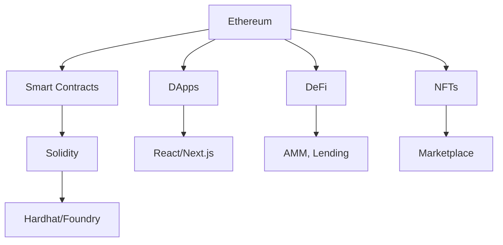

Blockchain là công nghệ **phi tập trung** cho phép lưu trữ dữ liệu một cách minh bạch, an toàn và không thể giả mạo — mà không cần bên thứ ba tin cậy.

## Blockchain là gì?

<Callout type="info">
Think of blockchain as a **shared digital ledger** — every participant has an identical copy, and new entries require consensus to be added. Once recorded, no one can alter the history.
</Callout>

## Tại sao học Blockchain?

<CardGroup>
  <Card title="Mức lương cao" icon="money-bill">
    Developer blockchain thường có mức lương cao hơn 30-50% so với web developer thông thường
  </Card>
  <Card title="Công nghệ mới" icon="rocket">
    Web3 đang phát triển mạnh — nhiều cơ hội startup và việc làm
  </Card>
  <Card title="Minh bạch" icon="eye">
    Blockchain giải quyết bài toán信任 — không cần tin vào bên thứ ba
  </Card>
  <Card title="Toàn cầu" icon="globe">
    Làm việc với dự án từ mọi nơi trên thế giới — phi tập trung = không biên giới
  </Card>
</CardGroup>

## Các khái niệm chính

| Khái niệm | Mô tả |
|---|---|
| **Blockchain** | Chuỗi blocks chứa giao dịch, được liên kết bằng cryptography |
| **Smart Contract** | Code tự động chạy khi điều kiện được đáp ứng |
| **DApp** | Ứng dụng phi tập trung — Frontend + Smart Contract |
| **DeFi** | Tài chính phi tập trung — cho vay, vay, giao dịch |
| **NFT** | Non-Fungible Token — chứng nhận sở hữu tài sản số |
| **DAO** | Tổ chức tự quản — quản trị bằng token và voting |
| **Token** | Đơn vị giá trị trên blockchain (ERC-20, ERC-721) |
| **Gas** | Phí giao dịch trên Ethereum |

## Ecosystem

## Khóa học này dạy gì?

<Check>
**Nền tảng:** Hiểu cách blockchain hoạt động, cryptography, consensus · **Solidity:** Viết smart contract từ cơ bản đến nâng cao · **Hardhat:** Test, debug, deploy contract · **DApp:** Kết nối frontend với blockchain · **DeFi & NFT:** Build AMM, lending, NFT marketplace
</Check>
