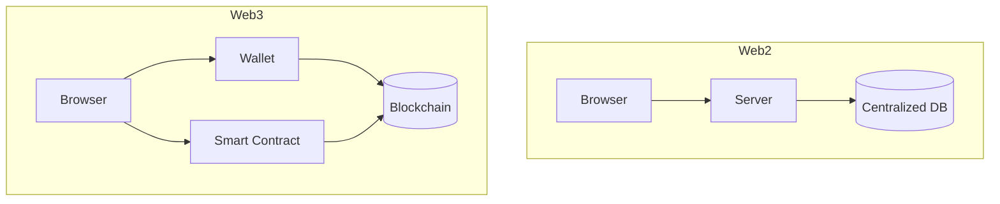

Hiểu sự khác biệt cốt lõi giữa Web2 và Web3 giúp bạn chuyển đổi tư duy thiết kế khi bắt đầu xây Web3 DApps.

## Architecture Comparison



## So sánh chi tiết

| Tiêu chí | Web2 | Web3 |
|---|---|---|
| **Server** | AWS, Vercel, Firebase | Không cần — smart contract chạy trên chain |
| **Database** | PostgreSQL, MongoDB | On-chain (Ethereum) + IPFS (off-chain) |
| **Auth** | Email/Password, OAuth | Sign-In with Ethereum (signature) |
| **Identity** | Username/email | Wallet address (0x...) |
| **Payment** | Stripe, PayPal | Crypto, token, ETH |
| **Hosting** | Vercel, Netlify | IPFS, Arweave |
| **State** | Server-side | On-chain state |
| **Data ownership** | Company owns | User owns |
| **Speed** | Milliseconds | Seconds (12-15s/block trên L1) |
| **Cost** | Server fees | Gas fees |

## Authentication

<Tabs>
  <Tab title="Web2 — Email/Password">
    ```javascript
    // Backend
    const bcrypt = require('bcrypt');

    app.post('/login', async (req, res) => {
      const { email, password } = req.body;
      const user = await User.findOne({ email });
      if (!user) return res.status(401).send('Invalid');

      const valid = await bcrypt.compare(password, user.passwordHash);
      if (!valid) return res.status(401).send('Invalid');

      // Session cookie
      req.session.userId = user._id;
      res.json({ token: generateJWT(user) });
    });
    ```

    Phải quản lý user database, hashing, session, JWT secret...
  </Tab>
  <Tab title="Web3 — Sign-In with Ethereum">
    ```javascript
    import { SiweMessage } from 'siwe';

    async function verifySignature(message, signature) {
      const siwe = new SiweMessage(message);
      const result = await siwe.verify({ signature });

      if (!result.success) throw new Error('Invalid signature');
      return siwe.address; // User's wallet address = user ID
    }

    // Frontend: User ký message
    const message = new SiweMessage({
      domain: window.location.host,
      address: account,
      statement: 'Sign in to MyApp',
      uri: window.location.origin,
      version: '1',
      chainId: 1
    });

    const signature = await signer.signMessage(message.prepareMessage());
    // Gửi lên backend verify
    ```

    Không cần password — user ký message chứng minh sở hữu private key.
  </Tab>
</Tabs>

## State Management

<CodeGroup>
```javascript Web2
// Web2: Server holds state
app.get('/api/user/balance/:id', async (req, res) => {
  const user = await User.findById(req.params.id);
  res.json({ balance: user.balance });
});

// Pros: Fast, free reads
// Cons: Trust the server
```

```javascript Web3
// Web3: State on-chain
const balance = await provider.getBalance(address);

// Pros: Trustless, transparent
// Cons: Slow (RPC), gas for writes
```
</CodeGroup>

## Frontend Patterns

<Tabs>
  <Tab title="Web2 — Loading">
    ```tsx
    function UserProfile() {
      const { data, isLoading } = useQuery({
        queryKey: ['user'],
        queryFn: fetchUser
      });

      if (isLoading) return <Spinner />;
      return <div>{data.name}</div>;
    }
    ```
  </Tab>
  <Tab title="Web3 — Pending">
    ```tsx
    function TransferForm() {
      const { writeContract, isPending } = useWriteContract();
      const { isLoading, isSuccess } = useWaitForTransactionReceipt();

      return (
        <button disabled={isPending || isLoading}>
          {isPending ? 'Confirm in wallet...' :
           isLoading ? 'Mining...' :
           isSuccess ? '✓ Done' :
           'Send'}
        </button>
      );
    }
    ```
  </Tab>
</Tabs>

## Khi nào dùng Web3?

<Check>
**Phù hợp với Web3:**
- Financial apps (DeFi, payments)
- NFT marketplaces
- Decentralized social networks
- Identity & credentials
- Gaming (play-to-earn)
- Token-gated content

**Không phù hợp:**
- Content marketing sites (Web2 đủ)
- Simple CMS (Web2 tốt hơn)
- Apps cần tốc độ realtime
- Apps không cần transparency
</Check>
